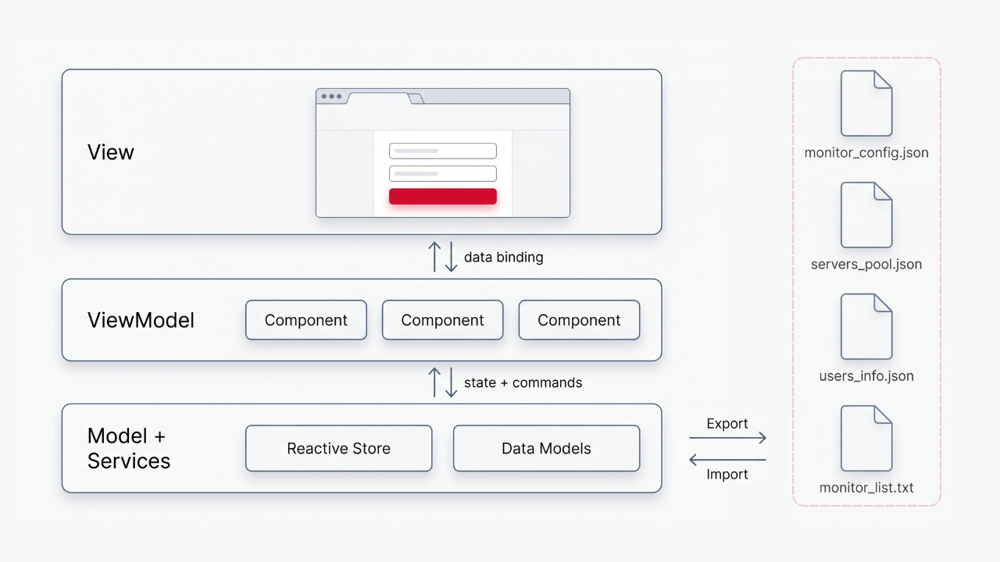

**client-availability-monitor (CAM)** é a interface web (SPA) do Availability Monitor — um painel para editar, validar e exportar os quatro arquivos de configuração consumidos pelo motor de monitoramento, o Server Availability Monitor (SAM), 100% local e em memória, sem backend.


### 📖 Glossário de Tecnologias

| Tecnologia      | Versão   | Descrição                                                                           |
| --------------- | -------- | ----------------------------------------------------------------------------------- |
| **Angular**     | **18.2** | **Framework SPA baseado em NgModules; estrutura toda a aplicação.**                 |
| **TypeScript**  | **5.5**  | **Superset tipado de JavaScript; linguagem de toda a base, em modo estrito.**       |
| RxJS            | 7.8      | Estado reativo dos stores, exposto como `Observable` e lido pelo `async` pipe.      |
| **Bootstrap**   | **5.3**  | **Framework CSS; provê o layout responsivo e os componentes visuais da interface.** |
| Bootstrap Icons | 1.13     | Biblioteca de ícones SVG utilizada na interface.                                    |
| Angular CLI     | 18.2     | Ferramenta de linha de comando: `build`, `serve` e execução dos testes.             |
| Jasmine         | 5.2      | Framework de testes (`describe` / `it` / `expect`) da suíte unitária.               |
| Karma           | 6.4      | Test runner que executa os specs em um navegador real.                              |

#### 🔒 Dependências e Segurança

O Angular 18 saiu do suporte oficial, então o `npm audit` acusa vulnerabilidades sem patch para a linha 18.2.x. Sendo uma SPA estática e offline (sem backend, `HttpClient` ou SSR), as advisories de framework não têm superfície de ataque, e as de tooling são de build-time, fora do bundle publicado. Zerá-las exigiria `ng update` para um Angular suportado, um upgrade de framework à parte.

## 🧭 Visão Geral

O CAM substitui a edição manual dos arquivos do SAM por uma interface dividida em quatro abas:

| Aba            | Arquivo               | Função                                        |
| -------------- | --------------------- | --------------------------------------------- |
| Monitor Config | `monitor_config.json` | Formulário de SMTP, timings e concorrência.   |
| Users          | `users_info.json`     | CRUD dos destinatários das notificações.      |
| Servers        | `servers_pool.json`   | CRUD dos servidores monitoráveis (IP ou DNS). |
| Monitor List   | `monitor_list.txt`    | Seleção, por checkbox, dos servidores ativos. |

Os dados vivem inteiramente em memória (sem API, banco ou `localStorage`), semeados com valores de exemplo. O fluxo é:

1. **Começar** — a home apresenta o CAM e um botão “Get started” que abre as abas, já preenchidas com exemplos. Para partir de arquivos existentes, as abas têm seu próprio botão “Import”.
2. **Editar e validar** — cada aba valida os dados (campos obrigatórios, e-mail, IPv4, faixa de portas e unicidade de `hostname`/`email`, comparada case-insensitive + `trim`) e bloqueia o salvamento inválido. A importação valida o conteúdo do arquivo, não apenas o nome. Renomear ou remover um servidor em Servers propaga em cascata para Monitor List, preservando a integridade referencial.
3. **Exportar** — o “Export” de cada aba baixa aquele arquivo, pronto para a pasta do SAM.

## 🏛️ Arquitetura

O CAM segue o padrão de arquitetura MVVM, na forma idiomática do Angular, sobre uma camada de serviços (store) reativa, com:

<div align="center">
  
  <p><sub>ARQUITETURA</sub></p>
</div>

- **Model** — `models/` (interfaces em `snake_case`) + `services/` (os stores em memória juntamente com as regras de domínio: validação de conteúdo e a cascata de integridade referencial).
- **View** — os templates `*.html` (marcação Bootstrap), com binding via Reactive Forms e `async` pipe.
- **ViewModel** — as classes de componente (`*.component.ts`): expõem estado observável/derivado (`view$`, `isEditing`, `removalRequest`) e comandos (`submit`, `confirmRemoval`), delegando persistência e domínio aos serviços.

Cada serviço estende `ArtifactStore<T>` (um `BehaviorSubject` exposto como `value$`) e cumpre o contrato `ArtifactIo`, que o `page-header` consome de forma polimórfica, sem conhecer o artefato concreto. O estado é singleton (`providedIn: 'root'`), então abas distintas compartilham a mesma fonte de verdade e reagem às mudanças umas das outras — ex.: o Monitor List recalcula os órfãos quando algum servidor em Servers muda.

## 🛠️ Instalação e Execução

Os passos abaixo assumem um sistema operacional "zerado" e devem ser executados a partir da raiz do projeto:

### 1️⃣ Instalar o Node.js

O Angular 18 exige Node.js ≥ 18.19 — recomenda-se o Node 22 LTS. Instale-o pela documentação oficial e, ao concluir, retorne a este guia para continuar:

- [Download e instalação do Node.js](https://nodejs.org/en/download)

> O desenvolvimento usou o [Node v24.14.1](https://nodejs.org/dist/v24.14.1/), mas o Node 22 LTS é o recomendado por estar na matriz de suporte oficial do Angular 18.

Com o Node instalado, confirme a versão (deve ser ≥ 18.19):

```bash
node -v
```

### 2️⃣ Instalar o Angular CLI

Com o Node pronto, instale o Angular CLI 18 globalmente:

```bash
npm install -g @angular/cli@18
```

Confirme a versão instalada (deve apontar `18.x`):

```bash
ng version
```

### 3️⃣ Instalar as Dependências

```bash
npm install
```

### 4️⃣ Executar

```bash
ng serve  # dev server em http://localhost:4200/ (recarrega ao salvar)
ng build  # build de produção em dist/client-availability-monitor/browser/
```

### 🚀 Deploy de Produção (GitHub Pages)

O deploy da aplicação é feito de forma totalmente automatizada via GitHub Actions ([`.github/workflows/deploy.yml`](.github/workflows/deploy.yml)). A cada push na branch `main`, o pipeline de CI/CD:

- Baixa o código e instala as dependências.
- Roda os testes em Chrome headless.
- Gera o build de produção.
- Publica apenas os arquivos finais (pasta `dist/client-availability-monitor/browser/`) na branch `gh-pages`.

O GitHub Pages serve a aplicação diretamente dessa branch compilada.

## 🧪 Cobertura de Testes

A suíte de testes cobre:

- Validadores (`validators/app-validators.spec.ts`) — `isIntegerControl`, `isPortControl`, `isEmailControl`, `isIpv4Control`, `isExactlyOneOfControl`, `isUniqueInControl` e o auxiliar `hasError`.
- Integridade referencial (`services/servers-pool.service.spec.ts`) — a cascata Servers → Monitor List ao renomear ou remover um servidor.
- Guards de importação (`services/*.service.spec.ts`) — cada `import` aceita um arquivo válido e rejeita JSON malformado, formato inválido e duplicatas.

Execute-a com:

```bash
ng test          # Karma + Jasmine em modo watch (exige Chrome/Chromium)
npm run test:ci  # execução única em Chrome headless (usada na CI)
```

## 🗂️ Estruturação

```
client-availability-monitor/
├── .github/workflows/
│   └── deploy.yml
├── src/
│   ├── app/
│   │   ├── components/
│   │   │   ├── home/
│   │   │   ├── layout/
│   │   │   ├── navbar/
│   │   │   ├── monitor-config/
│   │   │   ├── users-info/
│   │   │   ├── servers-pool/
│   │   │   ├── monitor-list/
│   │   │   ├── page-header/
│   │   │   ├── confirm-dialog/
│   │   │   └── alert/
│   │   ├── services/
│   │   │   ├── base/
│   │   │   ├── contract/
│   │   │   ├── monitor-config.service.ts
│   │   │   ├── users-info.service.ts
│   │   │   ├── servers-pool.service.ts
│   │   │   ├── monitor-list.service.ts
│   │   │   └── export.service.ts
│   │   ├── directives/
│   │   ├── models/
│   │   ├── validators/
│   │   │   ├── app-validators.ts
│   │   │   ├── monitor-config.validators.ts
│   │   │   ├── servers-pool.validators.ts
│   │   │   └── users-info.validators.ts
│   │   ├── app.module.ts
│   │   └── app-routing.module.ts
│   ├── index.html
│   ├── main.ts
│   └── styles.css
├── angular.json
├── karma.conf.js
└── package.json
```

### 📁 `src/app/`

Código-fonte da aplicação.

#### 📁 `components/`

Um componente por aba (declarados em `app.module.ts`, sem standalone), mais os apresentacionais compartilhados — `page-header`, `confirm-dialog` e `alert`. O `layout` envolve a `navbar` e o `<router-outlet>`; o `home` é a landing page.

#### 📁 `services/`

Camada de estado e I/O. Cada aba (referente a um dos quatro artefatos de configuração) tem um serviço que estende `ArtifactStore<T>` (estado em memória reativo) e cumpre o contrato `ArtifactIo`; o `export.service` provê as primitivas de download (JSON / texto).

#### 📁 `validators/`

Validadores de formulário reativo e guards de conteúdo da importação: `app-validators.ts` reúne os predicados e validadores transversais, enquanto cada `*.validators.ts` traz o guard de um artefato.

#### 📁 `models/`

Interfaces TypeScript em `snake_case`, espelhando os JSONs do SAM.

#### 📁 `directives/`

Diretivas reutilizáveis (ex.: `appTooltip`, tooltips do Bootstrap).

## 📚 Referências

- Desafio técnico que originou este projeto, disponível em:
  - [`assets/technical-challenge.md`](./assets/technical-challenge.md)
  - [`assets/technical-challenge.pdf`](./assets/technical-challenge.pdf)
- Angular Project Structure Guide: Small, Medium and Large Projects. **Medium**, disponível em: [medium.com/@dragos.atanasoae_62577/angular-project-structure-guide](https://medium.com/@dragos.atanasoae_62577/angular-project-structure-guide-small-medium-and-large-projects-e17c361b2029).
- Download. **Node.js**, disponível em: [nodejs.org/en/download](https://nodejs.org/en/download).
- Installation. **Angular**, disponível em: [angular.dev/installation](https://angular.dev/installation).
